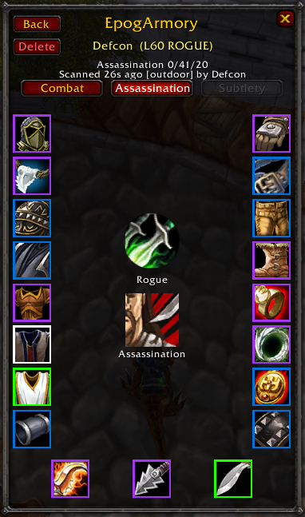
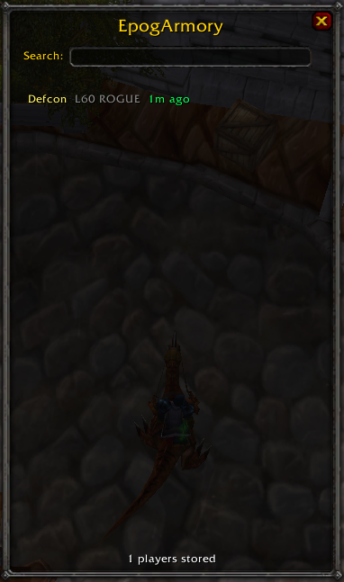

# EpogArmory

> **Inspect anyone on the server — no matter where they are.**

A WoW 3.3.5 addon for Project Ascension that lets you open an in-game paperdoll for any scanned player — even if they aren't in your group, aren't in interact range, or aren't even logged in. Every player running the addon contributes their inspects to a shared mesh, so the more people install it, the more of the server you can look up instantly.



## The main feature — inspect anyone, any time

Blizzard's built-in inspect is gated by:

- **Group membership** (party / raid only)
- **Interact range** (about 10 yards)
- **Line of sight** and other engine quirks

EpogArmory removes all three. Click the minimap shield button (or type `/epogarmory`) to open the browser, search for any player who's been seen by the mesh, and their paperdoll pops up immediately — full gear, enchants, gems, talent spec, item-level. Useful for:

- Gear-checking a PUG applicant before you invite them
- Spotting who's over-/under-geared in a raid without asking
- Settling "what trinket does X use?" mid-theorycraft
- Seeing what gear someone was wearing last week when they nailed a parse



The catch: a player only shows up once somebody in the mesh has inspected them. So running the addon yourself gates you into the mesh — you contribute your scans, everybody else's scans flow back to you.

## Per-spec gear sets

Every player gets up to three stored gear snapshots — one per dominant talent tree. A rogue with Combat / Assassination / Subtlety dual-spec setups will have separate sets stored, and the inspect frame lets you switch between them with a button click. The active spec is detected from the talent point distribution, not from any retail dual-spec API (which doesn't apply on Ascension's classless system).

## How data flows

```
 You inspect a groupmate
       ↓
 Addon packs gear + talents into a chunked payload
       ↓
 Broadcast on the addon-message channel to RAID/PARTY + GUILD
       ↓
 Every other installer reassembles and stores it locally
       ↓
 You can now open their paperdoll from /epogarmory — any time
       ↓
 Admin periodically uploads their SavedVariables → epoglogs.com/armory
```

Ten guildies installed means every gear scan any of them performs lands in all ten `SavedVariables` files, and the admin only has to upload one to push it to the public site.

## What it scans (and doesn't)

- **Inspects groupmates** in dungeons and raids, out of combat, level 60+, ≥10 slots equipped.
- **Self-scans** on gear changes and respecs so you always contribute your own current loadout.
- **Filters utility loadouts** — fishing poles, mount-speed trinkets, Chef's Hat, Mithril Spurs boot enchant, Riding Skill glove enchant, PvP Insignia trinkets, Rugged Sandal mount-speed boots. A bank-alt or PvP scan can't overwrite your real gear.
- **24-hour mesh cooldown** per player-GUID — the network won't re-scan a given player more than once per day, no matter how many groups they join.
- **Caches item names / quality / ilvl / stats** via `GetItemInfo` and `GetItemStats` so Ascension's modified stats and server-custom items resolve correctly on the public site even when Wowhead doesn't know them.

## Install

1. Download the latest `EpogArmory.zip` from [Releases](https://github.com/Defcons/epogarmory-addon/releases).
2. Extract so the `EpogArmory` folder lands in:
   ```
   <WoW root>/Interface/AddOns/
   ```
   On the Ascension Launcher this is typically:
   ```
   Ascension Launcher/resources/epoch_live/Interface/AddOns/
   ```
3. Restart the game (or `/reload` if already running).
4. A shield button appears on your minimap — left-click to open the browser, right-click for the menu. Or type `/epogarmory` in chat.

## Auto-update notification

When a peer running a newer version is in your guild/party/raid, you'll see a one-line chat message at login pointing to the releases page. Mesh stays compatible across versions for additive changes — only the version-ping line changes when an update is available.

## Commands

- `/epogarmory` — show command help
- `/epogarmory browse` — open the searchable browser
- `/epogarmory show <name>` — open a specific player's paperdoll directly (or target + `/epogarmory show`)
- `/epogarmory status` — scanner state + queue depth + storage counts
- `/epogarmory list` — print every stored player to chat
- `/epogarmory wipe` — clear stored players (keeps config)
- `/epogarmory instance on|off` — only scan in party/raid instances (default: on)
- `/epogarmory debug` — toggle verbose logging
- `/epogarmory cache` — show item-info cache size
- `/epogarmory cachebuild` — fill the cache from all stored players' gear (run once after install)
- `/epogarmory cachewipe` — clear the item-info cache

You can also right-click the minimap shield for a quick-action menu (Open / Status / Toggle Debug / Help / Wipe).

## Data stored on your machine

Two `SavedVariables` tables in `WTF/Account/<ACCT>/SavedVariables/EpogArmory.lua`:

- **`EpogArmoryDB`** — per-player records keyed by GUID. Each record stores the player's name, realm, class, level, talent-tab names + icons, and a `sets` table with up to 3 entries (one per dominant talent tree). Each set has the spec point distribution, the 19 gear slot itemstrings, scan timestamp, zone, and which mesh peer captured it.
- **`EpogItemCacheDB`** — per-item resolved data: name, quality, ilvl, icon, and Ascension's modified stat table from `GetItemStats`. The client's own item lookup, persisted so the public armory can render correct stats for Ascension-modified and server-custom items.

Nothing leaves your computer except via the addon-message channel (same class of traffic as DBM, Recount, Details, etc.). No web requests.

## Credits

Made by **Defcon**.

## License

MIT.
